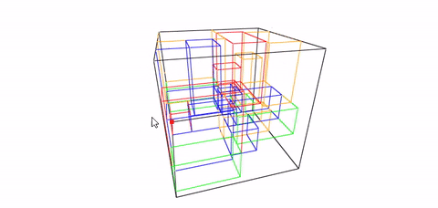

# BoxPacking: R package for solving three-dimensional bin packing problem

## Problem description


In the bin packing problem, the task is to select one or more bins from a set of available bins to pack three dimensional, rectangular boxes such that the usage of the bin space is maximized. [Read more about the problem.](https://en.wikipedia.org/wiki/Bin_packing_problem)

## Install


## Example

Consider an example where 20 boxes of different sizes are going to be packed into containers 2x2x2.

```
library(BoxPacking)

# create containers
containers <- list()
n_containers <- 4

for (i in 1:n_containers) {
    containers <- c(containers,
                    Container(length = 2, height = 2, width = 2)
                    )
}


# create boxes
boxes <- list()
n_boxes <- 20

for (i in 1:n_boxes) {
    length <- sample(c(0.4, 0.5, 1), 1)
    height <- sample(c(0.4, 0.5, 1), 1)
    width <- sample(c(0.4, 0.5, 1), 1)

    boxes <- c(boxes,
               Box(length = length, height = height, width = width)
               )
}

# Box Packing
solution <-
    PerformBoxPacking(containers = containers,
                      boxes = boxes,
                      n_iter = 4,
                      population_size = 20,
                      elitism_size = 5,
                      crossover_prob = 0.5,
                      mutation_prob = 0.5,
                      verbose = TRUE,
                      plotSolution = TRUE
                      )
```


